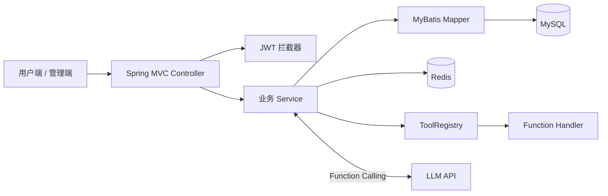

# sky-take-out

> 基于 Spring Boot 2.7 的餐饮点单后端系统，覆盖用户点餐、商家管理、订单履约、经营报表与 LLM Function Calling 智能服务。

[](https://openjdk.org/projects/jdk/11/)
[](https://spring.io/projects/spring-boot)
[](https://mybatis.org/spring-boot-starter/mybatis-spring-boot-autoconfigure/)
[](../../actions/workflows/maven-build.yml)

## 项目简介

`sky-take-out` 是一个多模块餐饮业务后端工程，分别提供用户端和管理端 API，并在传统点餐业务之上增加基于 Function Calling 的智能客服、经营分析和订单审核建议。

### 用户端能力

- 微信登录与 JWT 身份认证
- 菜品、套餐、购物车和地址簿管理
- 下单、支付、催单、取消和历史订单查询
- 多轮智能客服与业务数据查询

### 管理端能力

- 员工、分类、菜品和套餐管理
- 订单接单、拒单、配送、完成和取消
- 营业状态、工作台与经营报表
- 经营数据分析与订单风险审核建议

## 系统架构



## 模块说明

```text
sky-take-out/
├── sky-common/                  # 通用常量、异常、配置、上下文和工具类
├── sky-pojo/                    # Entity、DTO、VO
├── sky-server/                  # Controller、Service、Mapper、智能工具和启动类
├── resources/database/sky.sql   # 数据库结构及初始化数据
├── docs/api-examples.http       # 常用接口请求示例
└── docs/local-development.md    # 本地开发说明
```

## 技术栈

| 类型 | 技术 |
|---|---|
| 开发语言 | Java 11 |
| Web 框架 | Spring Boot 2.7.3、Spring MVC |
| 数据访问 | MyBatis、PageHelper、Druid |
| 数据存储 | MySQL 8、Redis |
| 接口与鉴权 | REST API、JWT、Knife4j |
| 实时通信 | WebSocket |
| 报表导出 | Apache POI |
| 智能服务 | DeepSeek Chat、Function Calling |
| 工程构建 | Maven、GitHub Actions |

## 智能服务设计

系统通过 `ToolRegistry` 自动收集 `AiFunctionHandler` 实现，并按 `USER`、`ADMIN` 角色隔离权限。当前包含 13 个业务工具：

| 场景 | 主要工具 |
|---|---|
| 用户咨询 | 菜品推荐、菜品详情、分类查询、历史订单、商家信息、FAQ |
| 管理查询 | 订单检索、经营统计、销量排行、工作台概览 |
| 管理操作 | 订单状态管理 |
| 分析辅助 | 周期经营分析、订单风险审核建议 |

关键设计：

1. 会话历史保存在 Redis，并设置过期时间。
2. 用户端不能获得管理端查询和写操作工具。
3. 工具调用循环设置最大次数，避免异常请求持续执行。
4. 订单审核只生成风险分和建议，不直接修改订单状态。
5. 商家信息和 FAQ 通过配置文件维护。

## 快速启动

### 环境要求

- JDK 11
- Maven 3.6+
- MySQL 8
- Redis 6+

### 初始化数据库

```bash
mysql -u root -p < resources/database/sky.sql
```

脚本会创建 `sky_take_out` 数据库。初始化管理员账号为 `admin`，初始密码为 `123456`，仅用于本地开发，启动后应及时修改。

### 配置环境变量

必须配置 JWT 签名密钥：

```powershell
$env:SKY_JWT_ADMIN_SECRET="replace-with-a-random-admin-secret"
$env:SKY_JWT_USER_SECRET="replace-with-a-random-user-secret"
```

| 环境变量 | 默认值 | 用途 |
|---|---|---|
| `SKY_DB_HOST` | `localhost` | MySQL 地址 |
| `SKY_DB_PORT` | `3306` | MySQL 端口 |
| `SKY_DB_NAME` | `sky_take_out` | 数据库名称 |
| `SKY_DB_USERNAME` | `root` | 数据库用户名 |
| `SKY_DB_PASSWORD` | 空 | 数据库密码 |
| `SKY_REDIS_HOST` | `localhost` | Redis 地址 |
| `SKY_REDIS_PORT` | `6379` | Redis 端口 |
| `SKY_REDIS_PASSWORD` | 空 | Redis 密码 |
| `SKY_AI_API_KEY` | 空 | DeepSeek API Key |
| `SKY_WECHAT_APPID` | 空 | 微信小程序 AppID |
| `SKY_WECHAT_SECRET` | 空 | 微信小程序 Secret |
| `SKY_UPLOAD_PATH` | `./uploads` | 本地上传目录 |

未配置 DeepSeek 或微信凭证时，对应的智能对话、微信登录与支付能力不可用，但不影响 Maven 构建。

### 构建并启动

```bash
mvn -DskipTests package
mvn -pl sky-server spring-boot:run
```

- Knife4j：`http://localhost:8080/doc.html`
- 管理员登录：`POST /admin/employee/login`
- 用户端智能对话：`POST /user/ai/chat`
- 管理端智能对话：`POST /admin/ai/chat`

更多请求示例见 `docs/api-examples.http`。

## 安全说明

- 仓库不包含真实数据库密码、API Key、微信凭证或 JWT 密钥。
- 登录凭证、微信授权码、OpenID 和对话正文不写入业务日志。
- 生产环境必须替换初始化账号密码并使用高强度 JWT 密钥。
- 对外部署前应补充接口限流、审计、数据脱敏和更细粒度的权限控制。

## 项目来源与扩展

本项目基于“苍穹外卖”课程后端工程进行扩展。原有点餐业务模型和部分基础代码来自课程工程；本仓库在此基础上增加了智能服务工具注册、多轮会话、经营分析、订单审核建议及相关接口，并对公开配置和日志安全进行了整理。
